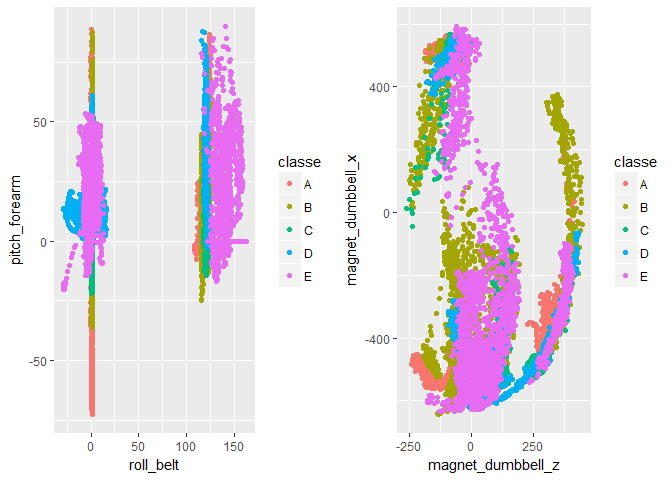
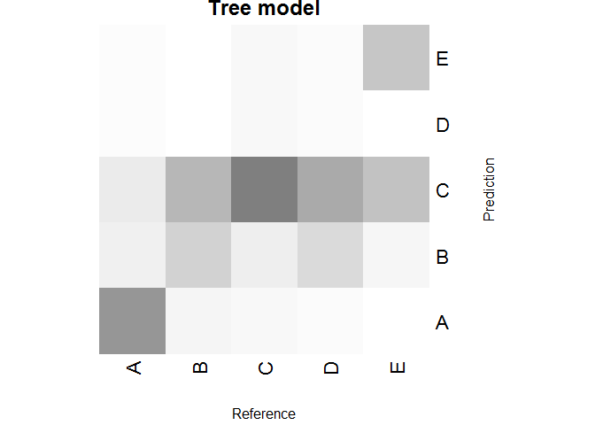
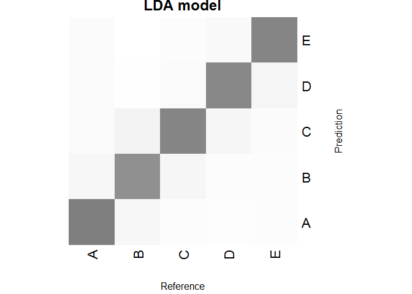
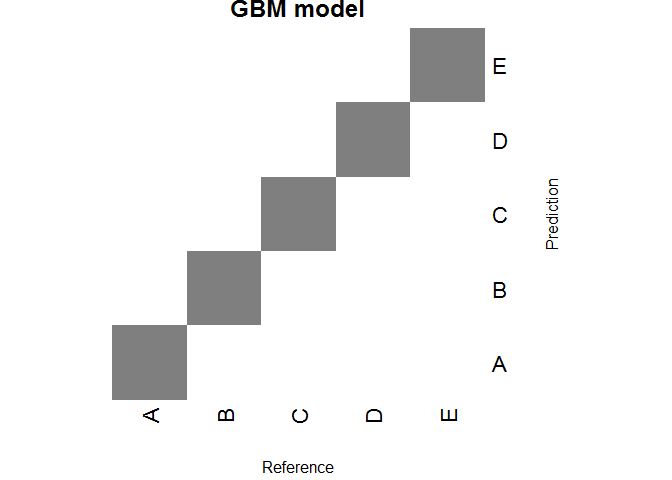

Overview
========

The goal of this project is to predict the manner in which human subjects did the exercise. We are going to use a weight lifting exercise dataset (<http://groupware.les.inf.puc-rio.br/har#weight_lifting_exercises>), which had been collected when six young health participants were asked to perform one set of 10 repetitions of the Unilateral Dumbbell Biceps Curl in five different fashions: exactly according to the specification (Class A), throwing the elbows to the front (Class B), lifting the dumbbell only halfway (Class C), lowering the dumbbell only halfway (Class D) and throwing the hips to the front (Class E). The "classe" variable in the training set includes these values and we use any of the other variables to build a prediction model for this.

Data loading
============

Let's start this project by loading the training and testing data set.

``` r
library(caret)
```

    ## Loading required package: lattice

    ## Loading required package: ggplot2

``` r
library(ggplot2)

train_data <- read.csv("pml-training.csv") # 19622 x 160
test_data <- read.csv("pml-testing.csv") # 20 x 160
```

We will use train\_data for the porject Quiz1, and test\_data for the project Quiz2.

Data preparation and EDA
========================

If we look over train\_data, when the variable 'NewWindow' = no, about 2/3 columns have NULL or N/A values, so we simply choose these dataset ('NewWindow' = no case) as a subset to reduce our dataset size. and use the following and analysis and modeling.

``` r
name_cols <- names(train_data)
# use this for initial analysis
ignore_cols <- name_cols[-c(2:11, 37:49, 60:68, 84:86, 102, 113:124, 140, 151:159, 160)] 
sel_cols <- name_cols[c(2:11, 37:49, 60:68, 84:86, 102, 113:124, 140, 151:159, 160)]
sel_cols_nolabel <- name_cols[c(2:11, 37:49, 60:68, 84:86, 102, 113:124, 140, 151:159)]
train_data_sel_cols <- train_data[, sel_cols]
test_data_sel_cols <- test_data[, c(2:11, 37:49, 60:68, 84:86, 102, 113:124, 140, 151:159)]
```

Then, let's split the training data with the reduced number of variables into training and testing dataset in 3 : 1 ratio, and use them for the model building, prediction, and model selection. Here, we use 3/4 of data for training a model and 1/4 of data for testing the model. We also utilize k-folds cross validation technique when training a model.

``` r
# data splitting for train and test
set.seed(817)
inTrain <- createDataPartition(y=train_data_sel_cols$classe, p=0.75, list = FALSE)
training <- train_data_sel_cols[inTrain,] 
testing <- train_data_sel_cols[-inTrain,] 
```

If we plot some variables such as roll\_belt, pitch\_forearm, magnet\_dumbbell\_x and magnet\_dumbbell\_z, we can see a clear separation of data into groups which correspond to the target classes in Figure 1.

``` r
library(gridExtra)
p1 <- qplot(roll_belt, pitch_forearm, colour= classe, data = training)
p2 <- qplot(magnet_dumbbell_z, magnet_dumbbell_x, colour= classe, data = training)
grid.arrange(p1, p2, ncol=2)
```



\[Figure 1.\] Example plotting of the variables: roll\_belt vs. pitch\_forearm (Left) and magnet\_dumbbell\_x vs. magnet\_dumbbell\_z (Right). Both plots show a pattern of data clustering into the target classes.

training models, and model selection
====================================

Now, we will fit 3 models with our training data, then predict outputs of the models with the testing dataset and calculate the resulting measures such as accuracy, sensitivity and specificity of the models. To reduce out of sample error, we will use K-folds cross-validatoin capability (k=5) in Caret package when training the models. The accuracy, sensitivity, and specificity of the models will be compared and the model with the best measure will be selected as our final model. The final chosen model will be used for the prediction task of project Quiz2. Three models used here are: tree, linear discriminant analysis (LDA), and gradient boosting machine (GBM). An example plot of classification tree from the tree model has been shown in Figure 2.

``` r
# define training control using k-fold Cross Validation
train_ctrl_cv <- trainControl(method="cv", number=5) # 5-folds cross-validation

## 1st model: Tree
mdl_tree <- train(classe ~ ., method="rpart", trControl=train_ctrl_cv, data=training)
pred_tree <- predict(mdl_tree, newdata=testing)
cm_tree <- confusionMatrix(pred_tree, testing$classe) 

## 2nd model: Linear Discriminant Analysis
mdl_lda <- train(classe ~., data=training, method="lda", trControl=train_ctrl_cv, verbose=FALSE) 
pred_lda <- predict(mdl_lda, newdata=testing)
cm_lda <- confusionMatrix(pred_lda, testing$classe)

## 3rd model: Gradient Boosting Machine
mdl_gbm <- train(classe ~., method="gbm", data=training, trControl=train_ctrl_cv, verbose=FALSE)
pred_gbm <- predict(mdl_gbm, newdata=testing)
cm_gbm <- confusionMatrix(pred_gbm, testing$classe)
```

After training the models, we can evaluate the performance of each model by comparing their accuracy, sensitivity, and positive predictive value for their classification results of testing data. The accuracy of the tree, LDA, and GBM models are **0.4940865**, **0.8592985**, and **0.9965334**, respectively. We have their sensitivity and positive predictive values as below, and observe that the GBM model demonstrate the hightes score on these measures:

``` r
print("Tree model:"); cm_tree$byClass[, c(1,3)];
```

    ## [1] "Tree model:"

    ##          Sensitivity Pos Pred Value
    ## Class: A   0.6645161      0.9061584
    ## Class: B   0.3804004      0.3461170
    ## Class: C   0.8561404      0.3011107
    ## Class: D   0.0000000            NaN
    ## Class: E   0.4472808      0.9901720

``` r
print("LDA model:"); cm_lda$byClass[, c(1,3)];
```

    ## [1] "LDA model:"

    ##          Sensitivity Pos Pred Value
    ## Class: A   0.9096774      0.9269540
    ## Class: B   0.7471022      0.7895323
    ## Class: C   0.8678363      0.7556008
    ## Class: D   0.8470149      0.8523154
    ## Class: E   0.9023307      0.9497664

``` r
print("GBM model:"); cm_gbm$byClass[, c(1,3)];
```

    ## [1] "GBM model:"

    ##          Sensitivity Pos Pred Value
    ## Class: A   0.9964158      1.0000000
    ## Class: B   0.9989463      0.9916318
    ## Class: C   0.9918129      0.9988221
    ## Class: D   0.9987562      0.9913580
    ## Class: E   0.9966704      0.9988877

We visualize classification tables of the 3 models as below. The diagonal components indicate correct classification and the off-diagonal components indicate misclassification. The darkness of color is proportional to the number of correct classifications of the model.

``` r
heatmap(cm_tree$table, Colv = NA, Rowv = NA, scale="column", 
        col=gray.colors(1024, start = 1, end =0, gamma = 2.2, alpha = 0.5), margins = c(5,5),
        xlab = "Reference", ylab="Prediction", main="Tree model")
```



\[Figure 2.\] Visualization of the classification tables of the Tree model.

``` r
heatmap(cm_lda$table, Colv = NA, Rowv = NA, scale="column", 
        col=gray.colors(1024, start = 1, end =0, gamma = 2.2, alpha = 0.5), margins = c(5,5),
        xlab = "Reference", ylab="Prediction", main="LDA model")
```



\[Figure 3.\] Visualization of the classification tables of the LDA model.

``` r
heatmap(cm_gbm$table, Colv = NA, Rowv = NA, scale="column", 
        col=gray.colors(1024, start = 1, end =0, gamma = 2.2, alpha = 0.5), margins = c(5,5),
        xlab = "Reference", ylab="Prediction", main="GBM model")
```



\[Figure 4.\] Visualization of the classification tables of the GBM model.

Hence, now we know that the GBM model shows the best accuracy(**0.9965334**), classification performance, sensitivity and positive prediction values among 3 models.

Conclusion
==========

Based on the results of model performance measure comparison in the above, the gradient boosting machine demonstrates the best prediction performance among 3 models and has been selected as our final prediction model for project Quiz2.
